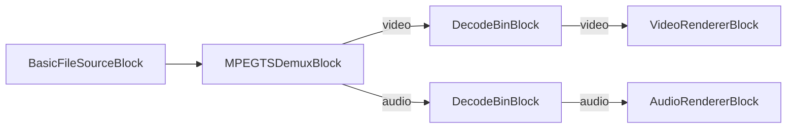

# Media Blocks SDK .Net - MPEG-TS Player Demo (C#/WPF)

Esta aplicación demuestra las capacidades del SDK.

## Bloques de medios utilizados

* `BasicFileSourceBlock` - File source
* `MPEGTSDemuxBlock` - MPEG-TS demuxer
* `DecodeBinBlock` - Media decoder
* `SourceSwitchBlock` - Stream switching
* `VideoRendererBlock` - Real-time video display
* `AudioRendererBlock` - Real-time audio playback

## Pipeline

## Frameworks soportados

* .Net 4.7.2
* .Net Core 3.1
* .Net 5
* .Net 6
* .Net 7
* .Net 8
* .Net 9
* .Net 10

---

[Visit the product page.](https://www.visioforge.com/media-blocks-sdk)
