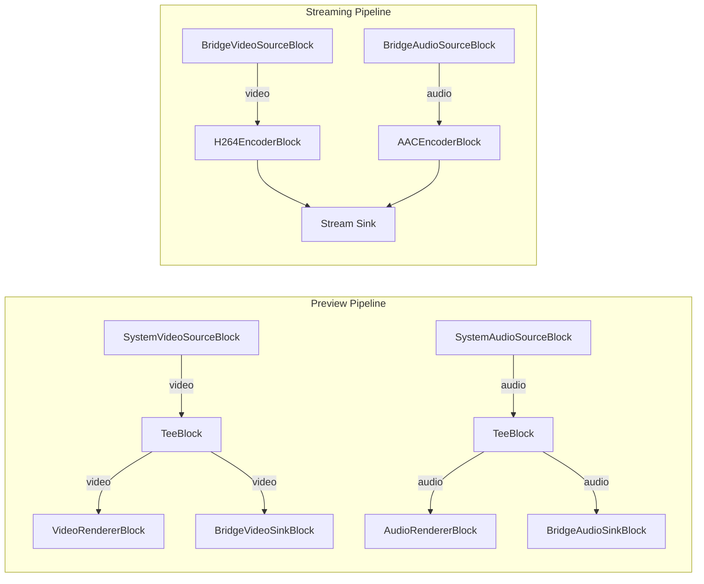

# Media Blocks SDK .Net - Networks Streamer Demo with Bridge (C#/WPF)

Esta aplicación demuestra pipelines independientes de vista previa y transmisión utilizando la arquitectura de bridge. Puede iniciar/detener la transmisión a YouTube o Facebook sin afectar la vista previa local.

## Características

* Pipelines independientes de vista previa y transmisión
* Transmisión a YouTube Live o Facebook Live
* Captura de cámara como fuente de video
* Captura de audio del sistema
* Iniciar/detener la transmisión sin interrumpir la vista previa

## Bloques de medios utilizados

* `SystemVideoSourceBlock` - Captura de cámara de video
* `SystemAudioSourceBlock` - Captura de audio del sistema
* `BridgeVideoSinkBlock` / `BridgeVideoSourceBlock` - Bridge de video
* `BridgeAudioSinkBlock` / `BridgeAudioSourceBlock` - Bridge de audio
* `H264EncoderBlock` - Codificación de video H.264/AVC
* `AACEncoderBlock` - Codificación de audio AAC
* `YouTubeSinkBlock` - Transmisión en vivo a YouTube
* `FacebookLiveSinkBlock` - Transmisión en vivo a Facebook
* `TeeBlock` - División de flujo
* `VideoRendererBlock` - Visualización de video en tiempo real
* `AudioRendererBlock` - Reproducción de audio en tiempo real

## Pipeline

## Frameworks soportados

* .Net 4.7.2
* .Net Core 3.1
* .Net 5
* .Net 6
* .Net 7
* .Net 8
* .Net 9
* .Net 10

---

[Visite la página del producto.](https://www.visioforge.com/media-blocks-sdk)
