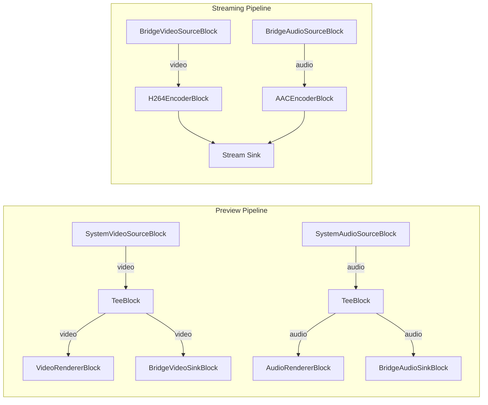

# Media Blocks SDK .Net - Networks Streamer Demo with Bridge (C#/WPF)

This application demonstrates independent preview and streaming pipelines using the bridge architecture. You can start/stop streaming to YouTube or Facebook without affecting the local preview.

## Features

* Independent preview and streaming pipelines
* Stream to YouTube Live or Facebook Live
* Camera capture as video source
* System audio capture
* Start/stop streaming without interrupting preview

## Used media blocks

* `SystemVideoSourceBlock` - Video camera capture
* `SystemAudioSourceBlock` - System audio capture
* `BridgeVideoSinkBlock` / `BridgeVideoSourceBlock` - Video bridge
* `BridgeAudioSinkBlock` / `BridgeAudioSourceBlock` - Audio bridge
* `H264EncoderBlock` - H.264/AVC video encoding
* `AACEncoderBlock` - AAC audio encoding
* `YouTubeSinkBlock` - YouTube Live streaming
* `FacebookLiveSinkBlock` - Facebook Live streaming
* `TeeBlock` - Stream splitting
* `VideoRendererBlock` - Real-time video display
* `AudioRendererBlock` - Real-time audio playback

## Pipeline

## Supported frameworks

* .Net 4.7.2
* .Net Core 3.1
* .Net 5
* .Net 6
* .Net 7
* .Net 8
* .Net 9
* .Net 10

---

[Visit the product page.](https://www.visioforge.com/media-blocks-sdk)
