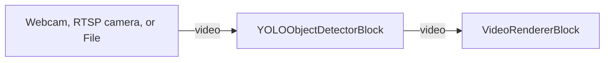

# Media Blocks SDK .Net - Object Detection Demo (C#/WPF)

This application runs an ONNX object-detection model over a live webcam stream, an RTSP/IP camera, or a
video file, draws the detected bounding boxes and labels onto the video in real time, and lists every
detection with its class label and confidence.

It supports three model families, selected on the **Detector** tab:

* **YOLOX** (Megvii, Apache-2.0) — the default. A ready-to-run `yolox_nano.onnx` (COCO-80) is shipped with
  the demo and selected by default, so it works out of the box.
* **RT-DETR** (Apache-2.0) — transformer detector as exported by Hugging Face Transformers /
  onnx-community (NMS-free).
* **YOLOv8 / YOLO11** (Ultralytics) — supported if you bring your own model. See the licensing note below.

## Used media blocks

* `SystemVideoSourceBlock` - Webcam video capture
* `RTSPSourceBlock` - RTSP / IP camera capture
* `UniversalSourceBlock` - Video file playback
* `YOLOObjectDetectorBlock` - ONNX object detection (draws boxes + raises detection events). Despite the
  historical name it decodes YOLOX, RT-DETR, and YOLOv8/v11 via `YoloDetectorSettings.Model`.
* `VideoRendererBlock` - Real-time video display

## Pipeline

## How it works

1. Pick a source: a webcam (with format + frame rate), an RTSP/IP camera (URL + optional login/password), or
   a local video file.
2. On the **Detector** tab pick the **Model family**. The bundled `yolox_nano.onnx` is selected by default;
   pick a different `.onnx` model with the **...** button if you want.
3. Press **Start**. The detector runs inference on each frame on the pipeline's streaming thread, maps the
   results back to the original frame coordinates, optionally draws them, and raises `OnObjectsDetected` with
   the list of detected objects.

The detector uses `Microsoft.ML.OnnxRuntime` for inference and `SkiaSharp` for preprocessing and drawing.
On Windows the SDK ships the DirectML ONNX Runtime build, so inference runs on any DirectX 12 GPU out of
the box: the detector's `Provider` defaults to `OnnxExecutionProvider.Auto`, which picks the GPU when one is
available and falls back to the CPU otherwise. The demo logs the available providers on startup and the
provider actually engaged (for example, `Inference running on: DirectML`) in the **Log** tab. You can force
a specific backend by setting `YoloDetectorSettings.Provider` to `CPU`, `DirectML`, `CUDA`, or `CoreML`.
Because inference runs synchronously per frame, a heavy model can throttle the pipeline — use
`YoloDetectorSettings.FramesToSkip` to run inference on every Nth frame.

Each family is preprocessed according to its own convention automatically (YOLOX: top-left letterbox, no
0..1 normalization, BGR; RT-DETR: direct resize, 0..1 normalization, RGB; YOLOv8: centered letterbox, 0..1
normalization, RGB), and the model's fixed input size (for example 416×416 for YOLOX-nano) is detected from
the `.onnx` file, so you only need to pick the right **Model family**.

## Getting other models

### YOLOX (Apache-2.0)

Pre-exported YOLOX ONNX models (nano/tiny/s/m/l/x) are published on the
[YOLOX releases page](https://github.com/Megvii-BaseDetection/YOLOX/releases). The bundled model is
`yolox_nano.onnx`. Larger variants are more accurate but slower.

### RT-DETR (Apache-2.0)

Ready-made ONNX exports are available from the
[onnx-community](https://huggingface.co/onnx-community) organization on Hugging Face (for example the
`rtdetr_*` repositories). Download `onnx/model.onnx`, pick **RT-DETR** as the model
family, and select the file.

### YOLOv8 / YOLO11 (Ultralytics)

You can export a YOLOv8/YOLO11 model with the Ultralytics Python package
(`yolo export model=yolov8n.pt format=onnx imgsz=640 opset=12`), pick **YOLOv8 / YOLO11** as the model
family, and select the file. **Licensing:** Ultralytics YOLOv5/YOLOv8/YOLO11 are published under **AGPL-3.0**,
which covers the trained weights even after export to ONNX. Using such a model in a closed-source product
requires a commercial Ultralytics Enterprise License — that is the integrator's responsibility. This is why
the demo ships an Apache-2.0 model (YOLOX) by default.

### Notes

* ONNX Runtime needs a native build for the process architecture. It ships natives for `win-x64`,
  `win-arm64`, `linux-x64`, `linux-arm64`, `osx-arm64`, `android`, and `ios` — there is no `win-x86` /
  Intel-Mac / Alpine-musl native, so run the demo as a 64-bit (x64 or ARM64) process.
* For a custom-trained model, pass your own class names via `YoloDetectorSettings.Labels`. When `Labels` is
  left `null`, the built-in COCO-80 names are used.

## Model attribution

* The bundled `yolox_nano.onnx` is a YOLOX model by Megvii, released under the
  [Apache License 2.0](https://github.com/Megvii-BaseDetection/YOLOX/blob/main/LICENSE).
* Class labels are the standard COCO-80 set.

## Supported frameworks

* .Net 10 (Windows / WPF)

---

[Visit the product page.](https://www.visioforge.com/media-blocks-sdk)
