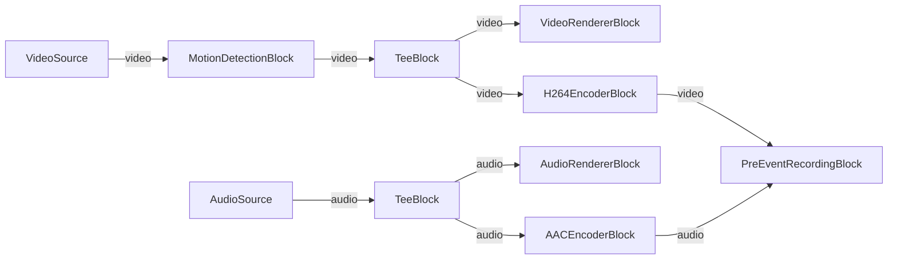

# Media Blocks SDK .Net - PreEventRecording (C#/WPF)

Esta aplicación demuestra la grabación pre-evento utilizando MediaBlocks, capturando video y audio con detección de movimiento y buffer circular para guardar metraje antes de que ocurra el evento de activación.

## Bloques de medios utilizados

* `SystemVideoSourceBlock` - Captura de video de webcam
* `SystemAudioSourceBlock` - Captura de audio del sistema
* `MotionDetectionBlock` - Detección de movimiento
* `TeeBlock` - División de flujo
* `VideoRendererBlock` - Visualización de video en tiempo real
* `AudioRendererBlock` - Reproducción de audio en tiempo real
* `H264EncoderBlock` - Codificación de video H.264
* `AACEncoderBlock` - Codificación de audio AAC
* `PreEventRecordingBlock` - Grabación con buffer pre-evento

## Pipeline

## Frameworks soportados

* .Net 4.7.2
* .Net Core 3.1
* .Net 5
* .Net 6
* .Net 7
* .Net 8
* .Net 9
* .Net 10

---

[Visit the product page.](https://www.visioforge.com/media-blocks-sdk)
