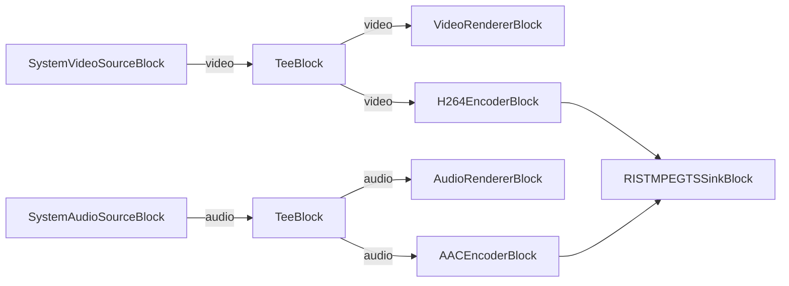

# Media Blocks SDK .Net - RIST Streamer Demo (C#/WPF)

This application captures video and audio from local devices, encodes them to H.264/AAC, and streams over RIST (Reliable Internet Stream Transport) protocol using MPEG-TS.

## Used media blocks

* `SystemVideoSourceBlock` - Camera video capture
* `SystemAudioSourceBlock` - Microphone audio capture
* `VideoRendererBlock` - Real-time video preview
* `AudioRendererBlock` - Real-time audio playback
* `TeeBlock` - Stream splitting for preview and encoding paths
* `H264EncoderBlock` - H.264/AVC video encoding
* `AACEncoderBlock` - AAC audio encoding
* `RISTMPEGTSSinkBlock` - RIST MPEG-TS streaming output

## Pipeline

## Supported frameworks

* .Net 10

---

[Visit the product page.](https://www.visioforge.com/media-blocks-sdk)
