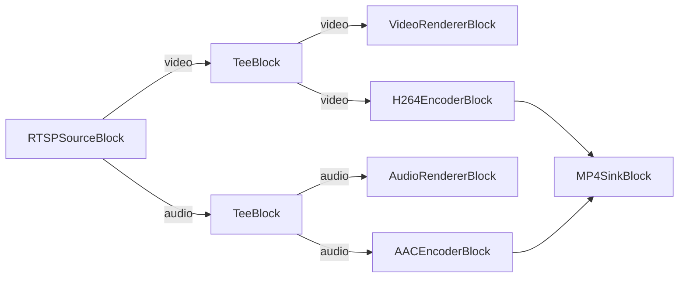

# Media Blocks SDK .Net - RTSP Capture Demo (C#/WPF)

Esta aplicación se conecta a flujos RTSP de cámaras IP, muestra una vista previa en vivo con modo opcional de baja latencia y puede grabar el flujo en archivos MP4 o MPEG-TS. Incluye funciones de descubrimiento y control de cámaras ONVIF.

## Bloques de medios utilizados

* `RTSPSourceBlock` - RTSP stream source
* `VideoRendererBlock` - Real-time video preview
* `AudioRendererBlock` - Real-time audio playback
* `TeeBlock` - Stream splitting for preview and recording paths
* `H264EncoderBlock` - H.264/AVC video encoding
* `AACEncoderBlock` - AAC audio encoding
* `MP4SinkBlock` - MP4 file output
* `MPEGTSSinkBlock` - MPEG-TS file output

## Pipeline

## Frameworks soportados

* .Net 10

---

[Visit the product page.](https://www.visioforge.com/media-blocks-sdk)
