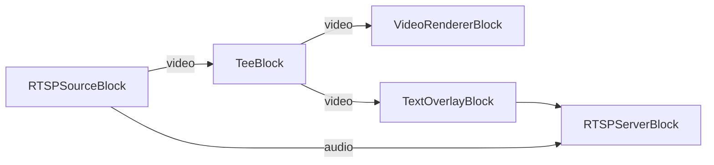

# Media Blocks SDK .Net - RTSP Restreamer (C#/WPF)

This application connects to RTSP/IP cameras for live video streaming, splits video stream for multiple outputs.

## Used media blocks

* `RTSPSourceBlock` - RTSP stream input
* `TeeBlock` - Stream splitting
* `VideoRendererBlock` - Real-time video display
* `TextOverlayBlock` - Text overlay
* `RTSPServerBlock` - RTSP server output

## Pipeline

## Supported frameworks

* .Net 4.7.2
* .Net Core 3.1
* .Net 5
* .Net 6
* .Net 7
* .Net 8
* .Net 9
* .Net 10

---

[Visit the product page.](https://www.visioforge.com/media-blocks-sdk)
