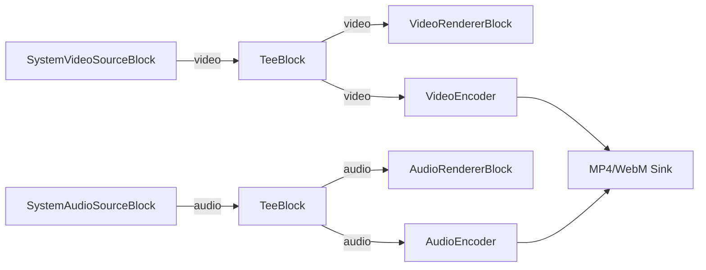

# Media Blocks SDK .Net - Simple Capture Demo (C#/WPF)

This application captures system audio output, saves output to MP4 format, saves output to WebM format, splits video stream for multiple outputs.

## Used media blocks

* `SystemAudioSourceBlock` - System audio capture
* `H264EncoderBlock` - H.264/AVC video encoding
* `AACEncoderBlock` - AAC audio encoding
* `MP4SinkBlock` - MP4 file output
* `WebMSinkBlock` - WebM file output
* `TeeBlock` - Stream splitting
* `VideoRendererBlock` - Real-time video display
* `AudioRendererBlock` - Real-time audio playback

## Pipeline

## Supported frameworks

* .Net 4.7.2
* .Net Core 3.1
* .Net 5
* .Net 6
* .Net 7
* .Net 8
* .Net 9
* .Net 10

---

[Visit the product page.](https://www.visioforge.com/media-blocks-sdk)
