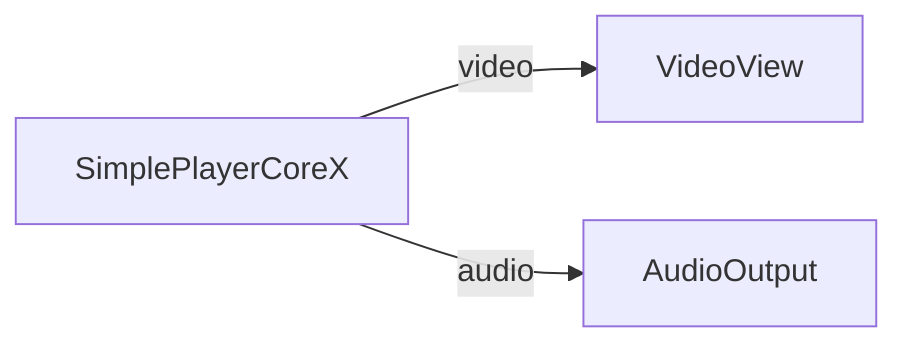

# Media Blocks SDK .Net - Simple Player Core Demo (C#/WPF)

This application plays media files using the SimplePlayerCoreX high-level API.

## Used media blocks

* `SimplePlayerCoreX` - High-level media player

## Pipeline

## Supported frameworks

* .Net 4.7.2
* .Net Core 3.1
* .Net 5
* .Net 6
* .Net 7
* .Net 8
* .Net 9
* .Net 10

---

[Visit the product page.](https://www.visioforge.com/media-blocks-sdk)
