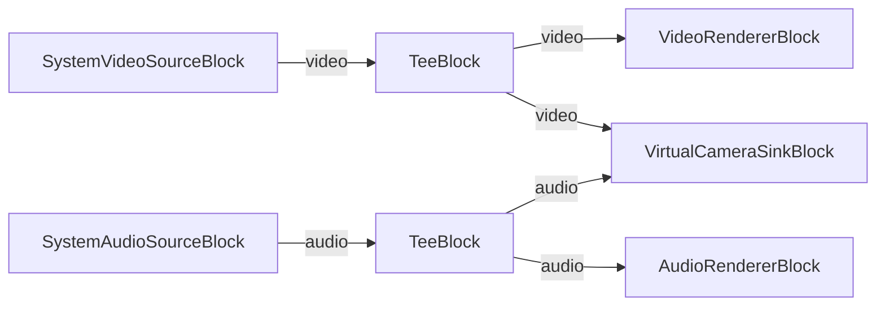

# Media Blocks SDK .Net - Virtual Camera Demo (C#/WPF)

Esta aplicacion transmite video de la webcam y audio del microfono a la Camara Virtual de VisioForge a traves de memoria compartida, haciendo que la senal este disponible para otras aplicaciones como Zoom, Teams y OBS.

## Bloques de medios utilizados

* `SystemVideoSourceBlock` - Captura de video de webcam
* `SystemAudioSourceBlock` - Captura de audio del microfono
* `TeeBlock` - Division de flujo para vista previa y salida de camara virtual
* `VideoRendererBlock` - Vista previa de video en tiempo real
* `AudioRendererBlock` - Vista previa de audio en tiempo real
* `VirtualCameraSinkBlock` - Salida de camara virtual via memoria compartida

## Pipeline

## Frameworks soportados

* .Net 4.7.2
* .Net Core 3.1
* .Net 5
* .Net 6
* .Net 7
* .Net 8
* .Net 9
* .Net 10

---

[Visit the product page.](https://www.visioforge.com/media-blocks-sdk)
