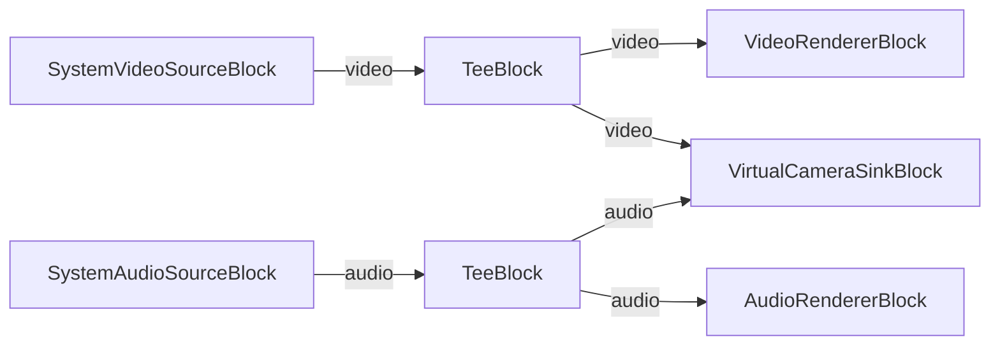

# Media Blocks SDK .Net - Virtual Camera Demo (C#/WPF)

This application streams webcam video and microphone audio to the VisioForge Virtual Camera via shared memory, making the feed available to other applications like Zoom, Teams, and OBS.

## Used media blocks

* `SystemVideoSourceBlock` - Webcam video capture
* `SystemAudioSourceBlock` - Microphone audio capture
* `TeeBlock` - Stream splitting for preview and virtual camera output
* `VideoRendererBlock` - Real-time video preview
* `AudioRendererBlock` - Real-time audio preview
* `VirtualCameraSinkBlock` - Virtual camera output via shared memory

## Pipeline

## Supported frameworks

* .Net 4.7.2
* .Net Core 3.1
* .Net 5
* .Net 6
* .Net 7
* .Net 8
* .Net 9
* .Net 10

---

[Visit the product page.](https://www.visioforge.com/media-blocks-sdk)
