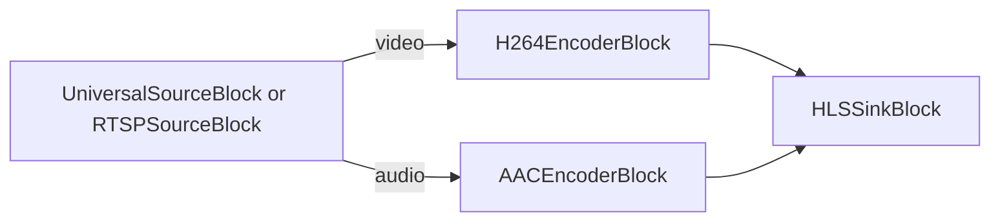

# Media Blocks SDK .Net - HLS Media Web Forms (C#/ASP.NET Web Forms)

Esta aplicación ASP.NET Web Forms codifica un archivo multimedia, una URL HTTP o una cámara RTSP a HLS en el servidor y lo reproduce en el navegador con el control de servidor `HlsPlayer`.

## Bloques de medios utilizados

* `UniversalSourceBlock` - Universal media file and URL playback
* `RTSPSourceBlock` - RTSP camera source
* `H264EncoderBlock` - H.264/AVC video encoding
* `AACEncoderBlock` - AAC audio encoding
* `HLSSinkBlock` - HLS segments and playlist output

## Pipeline

## Cómo ejecutar

1. Compile el proyecto.
2. Ejecute `run-iisexpress.cmd` (IIS Express de 64 bits).
3. Abra `http://localhost:8090/`, introduzca una ruta de archivo, una URL o una dirección RTSP y pulse Play.

El `web.config` del sitio necesita:

* `<hostingEnvironment shadowCopyBinAssemblies="false" />` - el SDK carga sus bibliotecas nativas desde `bin\x64`.
* Un tipo MIME `.m3u8` (`application/vnd.apple.mpegurl`) en `<staticContent>`.
* Un grupo de aplicaciones de 64 bits - las bibliotecas nativas son x64.

Esta demo acepta cualquier ruta de archivo y está pensada para ejecuciones locales; restrinja las fuentes antes de exponerla en una red.

## Frameworks soportados

* .Net Framework 4.7.2

---

[Visit the product page.](https://www.visioforge.com/media-blocks-sdk)
