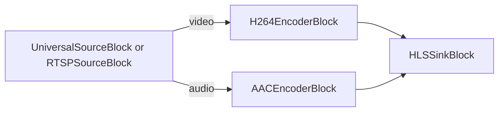

# Media Blocks SDK .Net - HLS Media Web Forms (C#/ASP.NET Web Forms)

This ASP.NET Web Forms application encodes a media file, an HTTP URL or an RTSP camera to HLS on the server and plays it in the browser with the `HlsPlayer` server control.

## Used media blocks

* `UniversalSourceBlock` - Universal media file and URL playback
* `RTSPSourceBlock` - RTSP camera source
* `H264EncoderBlock` - H.264/AVC video encoding
* `AACEncoderBlock` - AAC audio encoding
* `HLSSinkBlock` - HLS segments and playlist output

## Pipeline

## How to run

1. Build the project.
2. Run `run-iisexpress.cmd` (64-bit IIS Express).
3. Open `http://localhost:8090/`, enter a file path, URL or RTSP address and press Play.

The `web.config` of the site needs:

* `<hostingEnvironment shadowCopyBinAssemblies="false" />` - the SDK loads its native libraries from `bin\x64`.
* A `.m3u8` MIME type (`application/vnd.apple.mpegurl`) under `<staticContent>`.
* A 64-bit application pool - the native libraries are x64.

This demo accepts any file path and is meant for local runs; restrict the sources before exposing it on a network.

## Supported frameworks

* .Net Framework 4.7.2

---

[Visit the product page.](https://www.visioforge.com/media-blocks-sdk)
