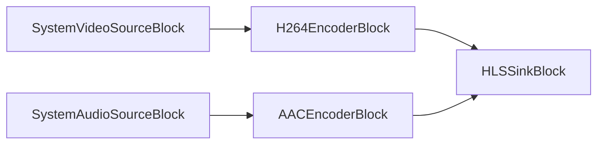

# Media Blocks SDK .Net - HLS Webcam Web Forms (C#/ASP.NET Web Forms)

Esta aplicación ASP.NET Web Forms captura una cámara y un micrófono en el servidor, los codifica a HLS y reproduce la transmisión en el navegador con el control de servidor `HlsPlayer`.

## Bloques de medios utilizados

* `SystemVideoSourceBlock` - Video capture device source
* `SystemAudioSourceBlock` - Audio capture device source
* `H264EncoderBlock` - H.264/AVC video encoding
* `AACEncoderBlock` - AAC audio encoding
* `HLSSinkBlock` - HLS segments and playlist output

## Pipeline

## Cómo ejecutar

1. Compile el proyecto.
2. Ejecute `run-iisexpress.cmd` (IIS Express de 64 bits).
3. Abra `http://localhost:8091/`, seleccione una cámara y un micrófono y pulse Start.

En IIS, el proceso de trabajo debe tener permiso para abrir la cámara; para un despliegue en servidor es preferible la demo de archivo/RTSP (HLS Media Web Forms).

El `web.config` del sitio necesita:

* `<hostingEnvironment shadowCopyBinAssemblies="false" />` - el SDK carga sus bibliotecas nativas desde `bin\x64`.
* Un tipo MIME `.m3u8` (`application/vnd.apple.mpegurl`) en `<staticContent>`.
* Un grupo de aplicaciones de 64 bits - las bibliotecas nativas son x64.

## Frameworks soportados

* .Net Framework 4.7.2

---

[Visit the product page.](https://www.visioforge.com/media-blocks-sdk)
