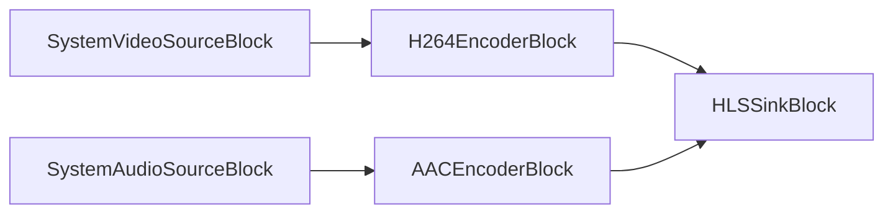

# Media Blocks SDK .Net - HLS Webcam Web Forms (C#/ASP.NET Web Forms)

This ASP.NET Web Forms application captures a camera and a microphone on the server, encodes them to HLS and plays the stream in the browser with the `HlsPlayer` server control.

## Used media blocks

* `SystemVideoSourceBlock` - Video capture device source
* `SystemAudioSourceBlock` - Audio capture device source
* `H264EncoderBlock` - H.264/AVC video encoding
* `AACEncoderBlock` - AAC audio encoding
* `HLSSinkBlock` - HLS segments and playlist output

## Pipeline

## How to run

1. Build the project.
2. Run `run-iisexpress.cmd` (64-bit IIS Express).
3. Open `http://localhost:8091/`, select a camera and a microphone and press Start.

Under IIS the worker process must be allowed to open the camera; for a server deployment prefer the file/RTSP demo (HLS Media Web Forms).

The `web.config` of the site needs:

* `<hostingEnvironment shadowCopyBinAssemblies="false" />` - the SDK loads its native libraries from `bin\x64`.
* A `.m3u8` MIME type (`application/vnd.apple.mpegurl`) under `<staticContent>`.
* A 64-bit application pool - the native libraries are x64.

## Supported frameworks

* .Net Framework 4.7.2

---

[Visit the product page.](https://www.visioforge.com/media-blocks-sdk)
