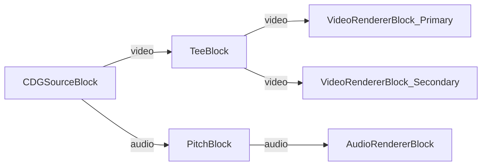

# Media Blocks SDK .Net - Karaoke Demo (C#/WinForms)

Esta aplicación reproduce archivos de karaoke CDG (o archivos ZIP que contienen CDG y audio) con salida de video de doble pantalla y cambio de tono en tiempo real.

## Bloques de medios utilizados

* `CDGSourceBlock` - Fuente de archivos de karaoke CDG/ZIP
* `TeeBlock` - División de flujo para salida de video dual
* `VideoRendererBlock` - Visualización de video en tiempo real (ventanas primaria y secundaria)
* `PitchBlock` - Cambio de tono de audio en tiempo real
* `AudioRendererBlock` - Reproducción de audio en tiempo real

## Pipeline

## Frameworks soportados

* .Net 4.7.2
* .Net Core 3.1
* .Net 5
* .Net 6
* .Net 7
* .Net 8
* .Net 9
* .Net 10

---

[Visit the product page.](https://www.visioforge.com/media-blocks-sdk)
