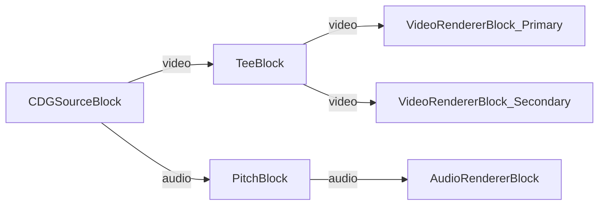

# Media Blocks SDK .Net - Karaoke Demo (C#/WinForms)

This application plays CDG karaoke files (or ZIP archives containing CDG and audio) with dual-screen video output and real-time pitch shifting.

## Used media blocks

* `CDGSourceBlock` - CDG/ZIP karaoke file source
* `TeeBlock` - Stream splitting for dual video output
* `VideoRendererBlock` - Real-time video display (primary and secondary windows)
* `PitchBlock` - Real-time audio pitch shifting
* `AudioRendererBlock` - Real-time audio playback

## Pipeline

## Supported frameworks

* .Net 4.7.2
* .Net Core 3.1
* .Net 5
* .Net 6
* .Net 7
* .Net 8
* .Net 9
* .Net 10

---

[Visit the product page.](https://www.visioforge.com/media-blocks-sdk)
