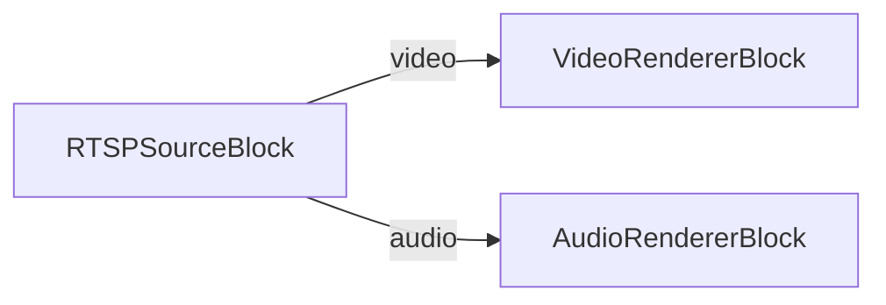
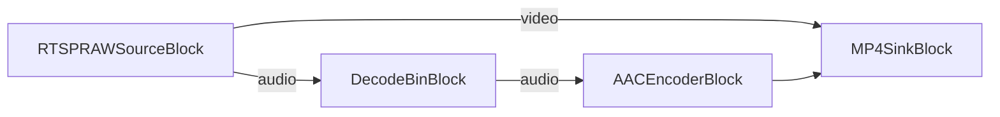

# Media Blocks SDK .Net - RTSP MultiView Demo (C#/WinForms)

Esta aplicación se conecta a cámaras RTSP/IP para transmisión de video en vivo, reproduce archivos multimedia usando el decodificador universal, guarda la salida en formato MP4 o MPEG-TS, soporta descubrimiento y control de cámaras ONVIF, soporta transmisión de ultra baja latencia.

## Bloques de medios utilizados

* `RTSPSourceBlock` - Entrada de flujo RTSP (modo reproducción)
* `RTSPRAWSourceBlock` - Entrada de flujo RTSP sin procesar (modo grabación)
* `UniversalSourceBlock` - Reproducción universal de archivos multimedia (modo HTTP/MJPEG)
* `DecodeBinBlock` - Decodificación de audio para re-codificación
* `AACEncoderBlock` - Codificación de audio AAC
* `MP4SinkBlock` - Salida de archivo MP4
* `MPEGTSSinkBlock` - Salida de archivo MPEG-TS
* `VideoRendererBlock` - Visualización de video en tiempo real
* `AudioRendererBlock` - Reproducción de audio en tiempo real

## Pipeline

### Reproducción (modo RTSP)

### Grabación (con re-codificación de audio)

## Frameworks soportados

* .Net 4.7.2
* .Net Core 3.1
* .Net 5
* .Net 6
* .Net 7
* .Net 8
* .Net 9
* .Net 10

---

[Visit the product page.](https://www.visioforge.com/media-blocks-sdk)
