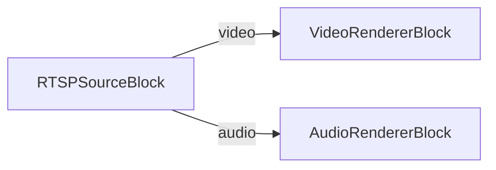
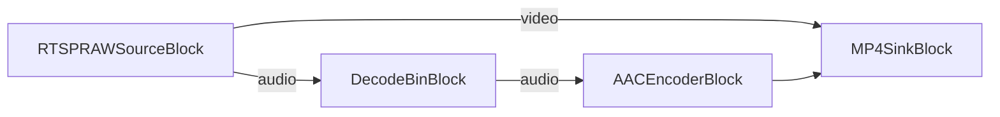

# Media Blocks SDK .Net - RTSP MultiView Demo (C#/WinForms)

This application connects to RTSP/IP cameras for live video streaming, plays media files using the universal source decoder, saves output to MP4 or MPEG-TS format, supports ONVIF camera discovery and control, supports ultra-low latency streaming.

## Used media blocks

* `RTSPSourceBlock` - RTSP stream input (playback mode)
* `RTSPRAWSourceBlock` - RTSP raw stream input (recording mode)
* `UniversalSourceBlock` - Universal media file playback (HTTP/MJPEG mode)
* `DecodeBinBlock` - Audio decoding for re-encoding
* `AACEncoderBlock` - AAC audio encoding
* `MP4SinkBlock` - MP4 file output
* `MPEGTSSinkBlock` - MPEG-TS file output
* `VideoRendererBlock` - Real-time video display
* `AudioRendererBlock` - Real-time audio playback

## Pipeline

### Playback (RTSP mode)

### Recording (with audio re-encoding)

## Supported frameworks

* .Net 4.7.2
* .Net Core 3.1
* .Net 5
* .Net 6
* .Net 7
* .Net 8
* .Net 9
* .Net 10

---

[Visit the product page.](https://www.visioforge.com/media-blocks-sdk)
