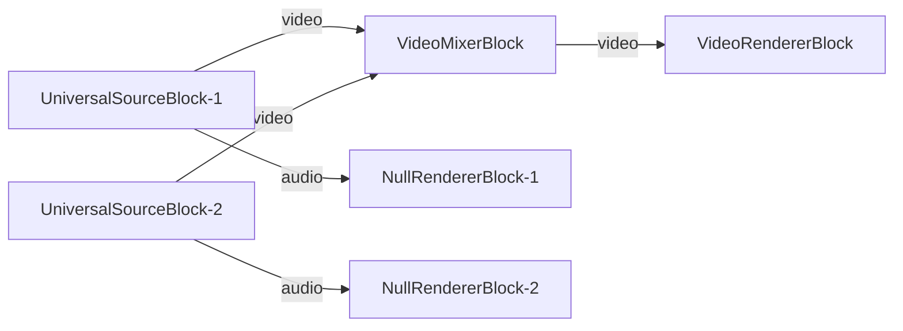

# Media Blocks SDK .Net - Video Mixer Demo (C#/WinForms)

Esta aplicación reproduce archivos multimedia usando el decodificador universal, compone múltiples fuentes de video en una sola salida.

## Bloques de medios utilizados

* `UniversalSourceBlock` - Universal media file playback
* `VideoCompositorBlock` - Multi-source compositing
* `VideoRendererBlock` - Real-time video display

## Pipeline

## Frameworks soportados

* .Net 4.7.2
* .Net Core 3.1
* .Net 5
* .Net 6
* .Net 7
* .Net 8
* .Net 9
* .Net 10

---

[Visit the product page.](https://www.visioforge.com/media-blocks-sdk)
