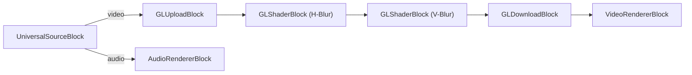

# Media Blocks SDK .Net - gaussian-blur (C#/WinForms)

This application plays media files using the universal source decoder and applies configurable Gaussian blur effects using OpenGL shaders for real-time video processing.

## Used media blocks

* `UniversalSourceBlock` - Universal media file playback
* `GLUploadBlock` - Upload video frames to GPU
* `GLShaderBlock` - OpenGL shader processing (horizontal and vertical blur passes)
* `GLDownloadBlock` - Download video frames from GPU
* `VideoRendererBlock` - Real-time video display
* `AudioRendererBlock` - Real-time audio playback

## Pipeline

## Supported frameworks

* .Net 4.7.2
* .Net Core 3.1
* .Net 5
* .Net 6
* .Net 7
* .Net 8
* .Net 9
* .Net 10

---

[Visit the product page.](https://www.visioforge.com/media-blocks-sdk)
