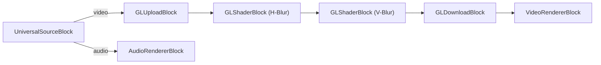

# Media Blocks SDK .Net - gaussian-blur (C#/WinForms)

Esta aplicación reproduce archivos multimedia usando el decodificador universal y aplica efectos de desenfoque gaussiano configurables usando shaders OpenGL para procesamiento de video en tiempo real.

## Bloques de medios utilizados

* `UniversalSourceBlock` - Reproducción universal de archivos multimedia
* `GLUploadBlock` - Subir fotogramas de video a la GPU
* `GLShaderBlock` - Procesamiento de shaders OpenGL (pasadas de desenfoque horizontal y vertical)
* `GLDownloadBlock` - Descargar fotogramas de video de la GPU
* `VideoRendererBlock` - Visualización de video en tiempo real
* `AudioRendererBlock` - Reproducción de audio en tiempo real

## Pipeline

## Frameworks soportados

* .Net 4.7.2
* .Net Core 3.1
* .Net 5
* .Net 6
* .Net 7
* .Net 8
* .Net 9
* .Net 10

---

[Visit the product page.](https://www.visioforge.com/media-blocks-sdk)
