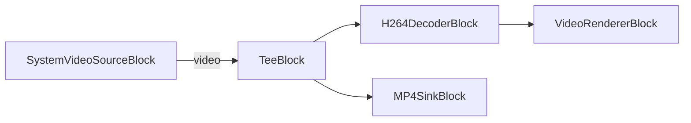

# Media Blocks SDK .Net - h264-capture-webcam (C#/WinForms)

Esta aplicación captura video H264 de una cámara web, lo previsualiza con decodificación y simultáneamente guarda el flujo H264 sin procesar en un archivo MP4.

## Bloques de medios utilizados

* `SystemVideoSourceBlock` - Captura de video de cámara web
* `TeeBlock` - División de flujo
* `H264DecoderBlock` - Decodificación de video H.264/AVC
* `VideoRendererBlock` - Visualización de video en tiempo real
* `MP4SinkBlock` - Salida de archivo MP4

## Pipeline

## Frameworks soportados

* .Net 4.7.2
* .Net Core 3.1
* .Net 5
* .Net 6
* .Net 7
* .Net 8
* .Net 9
* .Net 10

---

[Visit the product page.](https://www.visioforge.com/media-blocks-sdk)
