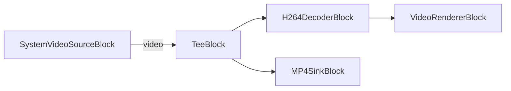

# Media Blocks SDK .Net - h264-capture-webcam (C#/WinForms)

This application captures H264 video from a webcam, previews it with decoding, and simultaneously saves the raw H264 stream to an MP4 file.

## Used media blocks

* `SystemVideoSourceBlock` - Webcam video capture
* `TeeBlock` - Stream splitting
* `H264DecoderBlock` - H.264/AVC video decoding
* `VideoRendererBlock` - Real-time video display
* `MP4SinkBlock` - MP4 file output

## Pipeline

## Supported frameworks

* .Net 4.7.2
* .Net Core 3.1
* .Net 5
* .Net 6
* .Net 7
* .Net 8
* .Net 9
* .Net 10

---

[Visit the product page.](https://www.visioforge.com/media-blocks-sdk)
