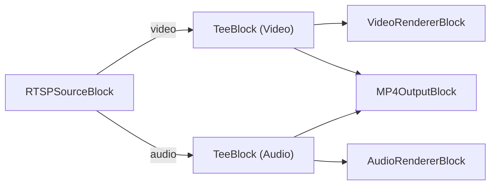

# Media Blocks SDK .Net - ip-camera-capture-mp4 (C#/WinForms)

This application connects to an RTSP/IP camera for live video streaming, previews the video and audio, and records both to an MP4 file.

## Used media blocks

* `RTSPSourceBlock` - RTSP stream input
* `TeeBlock` - Stream splitting (video and audio)
* `VideoRendererBlock` - Real-time video display
* `AudioRendererBlock` - Real-time audio playback
* `MP4OutputBlock` - MP4 file output

## Pipeline

## Supported frameworks

* .Net 4.7.2
* .Net Core 3.1
* .Net 5
* .Net 6
* .Net 7
* .Net 8
* .Net 9
* .Net 10

---

[Visit the product page.](https://www.visioforge.com/media-blocks-sdk)
