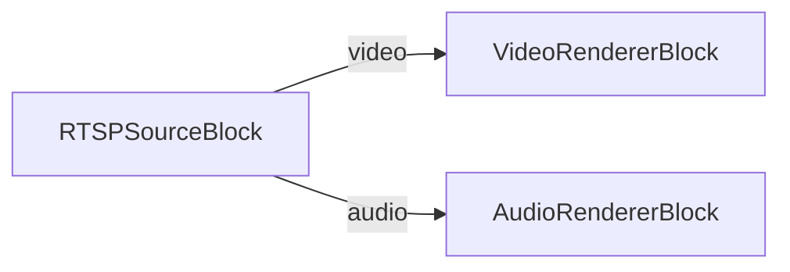

# Media Blocks SDK .Net - ip-camera-preview (C#/WinForms)

Esta aplicación se conecta a una cámara RTSP/IP para vista previa de video y audio en vivo.

## Bloques de medios utilizados

* `RTSPSourceBlock` - Entrada de flujo RTSP
* `VideoRendererBlock` - Visualización de video en tiempo real
* `AudioRendererBlock` - Reproducción de audio en tiempo real

## Pipeline

## Frameworks soportados

* .Net 4.7.2
* .Net Core 3.1
* .Net 5
* .Net 6
* .Net 7
* .Net 8
* .Net 9
* .Net 10

---

[Visit the product page.](https://www.visioforge.com/media-blocks-sdk)
