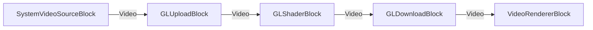

# Media Blocks SDK .Net - opengl-shader (C#/Console)

This application applies custom OpenGL shader effects for real-time video processing.

## Used media blocks

* `GLShaderBlock` - OpenGL shader processing
* `VideoRendererBlock` - Real-time video display

## Pipeline

## Supported frameworks

* .Net 4.7.2
* .Net Core 3.1
* .Net 5
* .Net 6
* .Net 7
* .Net 8
* .Net 9
* .Net 10

---

[Visit the product page.](https://www.visioforge.com/media-blocks-sdk)
