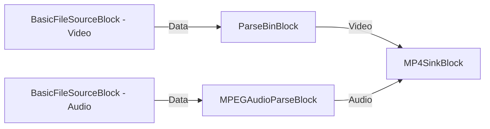

# Media Blocks SDK .Net - replace-audio (C#/Console)

Esta aplicación guarda la salida en formato MP4.

## Bloques de medios utilizados

* `MP4SinkBlock` - MP4 file output

## Pipeline

## Frameworks soportados

* .Net 4.7.2
* .Net Core 3.1
* .Net 5
* .Net 6
* .Net 7
* .Net 8
* .Net 9
* .Net 10

---

[Visit the product page.](https://www.visioforge.com/media-blocks-sdk)
