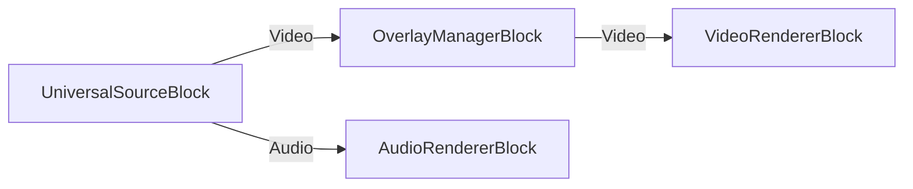

# Scrolling Text Overlay Code Snippet

This code snippet demonstrates how to add a scrolling text overlay to video playback using the VisioForge Media Blocks SDK.

## Features

- Video playback with `UniversalSourceBlock`
- Scrolling text overlay using `OverlayManagerScrollingText`
- Configurable text, speed, and appearance
- Shadow effect for better visibility

## Key Components

- `MediaBlocksPipeline` - Main pipeline for media processing
- `UniversalSourceBlock` - Video source from file
- `OverlayManagerBlock` - Manages overlays on video
- `OverlayManagerScrollingText` - Scrolling text overlay element
- `VideoRendererBlock` - Renders video to screen

## Usage

1. Select a video file
2. Enter the text to scroll
3. Set the scroll speed
4. Click Start to play

## Code Highlights

```csharp
// Create scrolling text overlay
var scrollingText = new OverlayManagerScrollingText(
    "Breaking News: Welcome to VisioForge!",
    x: 0, y: 50,
    speed: 5,
    direction: ScrollDirection.RightToLeft)
{
    DefaultWidth = 1920,
    Infinite = true,
    Color = SKColors.Yellow
};

// Add to overlay manager
overlayManager.Video_Overlay_Add(scrollingText);

// Connect pipeline
pipeline.Connect(fileSource.VideoOutput, overlayManager.Input);
pipeline.Connect(overlayManager.Output, videoRenderer.Input);
```

## Pipeline



## Supported frameworks

* .Net 4.7.2
* .Net Core 3.1
* .Net 5
* .Net 6
* .Net 7
* .Net 8
* .Net 9
* .Net 10

## Requirements

- Windows with WPF support
- VisioForge Media Blocks SDK
