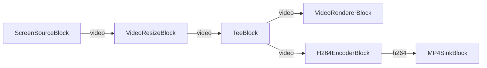

# Media Blocks SDK .Net - ScreenCaptureMB

This application captures desktop/screen content, saves output to MP4 format, splits video stream for multiple outputs.

## Used media blocks

* `ScreenSourceBlock` - Desktop screen capture
* `H264EncoderBlock` - H.264/AVC video encoding
* `MP4SinkBlock` - MP4 file output
* `TeeBlock` - Stream splitting
* `VideoRendererBlock` - Real-time video display

## Pipeline

## Supported frameworks

* .Net 4.7.2
* .Net Core 3.1
* .Net 5
* .Net 6
* .Net 7
* .Net 8
* .Net 9
* .Net 10

---

[Visit the product page.](https://www.visioforge.com/media-blocks-sdk)
