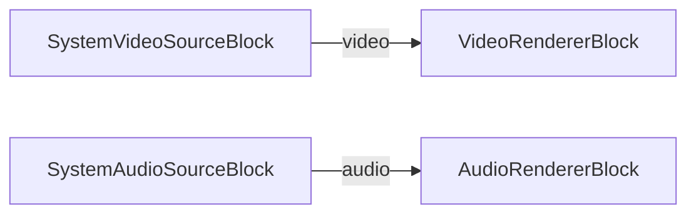

# Media Blocks SDK .Net - SimpleVideoCaptureMBMac

Esta aplicación captura la salida de audio del sistema.

## Bloques de medios utilizados

* `SystemAudioSourceBlock` - System audio capture
* `VideoRendererBlock` - Real-time video display
* `AudioRendererBlock` - Real-time audio playback

## Pipeline

## Frameworks soportados

* .Net 4.7.2
* .Net Core 3.1
* .Net 5
* .Net 6
* .Net 7
* .Net 8
* .Net 9
* .Net 10

---

[Visit the product page.](https://www.visioforge.com/media-blocks-sdk)
