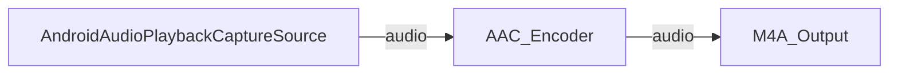

# Video Capture SDK X .Net - Audio Playback Capture (C#/Android)

Records the audio played by **other apps** on Android using the system
`AudioPlaybackCapture` API (Android 10 / API 29+) on top of a `MediaProjection`
token, encodes it to AAC, and saves an `.m4a` file to the device music library.

Unlike the Media Blocks SDK sample, this demo drives the high-level
`VideoCaptureCoreX` engine: you just assign the playback-capture source to
`Audio_Source`, add an `M4AOutput`, and call `StartAsync` / `StopAsync`.

## How it works

1. The user taps **Start Audio Capture**.
2. The app requests the `MediaProjection` permission (the same system dialog used for
   screen capture) and starts a `mediaProjection` foreground service.
3. After the service is in the foreground, the app obtains the `MediaProjection` token
   and passes it to `AndroidAudioPlaybackCaptureSourceSettings`.
4. `VideoCaptureCoreX` builds the audio-only pipeline (no video source, no preview),
   captures the played-back PCM, encodes AAC, and writes the `.m4a` file.

## Code outline

```csharp
_core = new VideoCaptureCoreX();                  // audio-only, no VideoView
_core.Audio_Source = new AndroidAudioPlaybackCaptureSourceSettings(mediaProjection);
_core.Audio_Play = false;
_core.Audio_Record = true;
_core.Outputs_Add(new M4AOutput(filename), true); // autostart with StartAsync
await _core.StartAsync();
// ...
await _core.StopAsync();
await _core.DisposeAsync();
```

## Pipeline



## Important: what can be captured

The `AudioPlaybackCapture` API only captures audio from apps that **allow** it:

- The playing app must target API 29+ and must not set
  `android:allowAudioPlaybackCapture="false"` in its manifest.
- Only audio with usage `MEDIA`, `GAME`, or `UNKNOWN` is capturable.

Many protected players (for example some music-streaming apps) explicitly **opt out**,
so capturing them returns silence. Test with a permissive player or a local media file.

## Required permissions

- `RECORD_AUDIO`
- `FOREGROUND_SERVICE`
- `FOREGROUND_SERVICE_MEDIA_PROJECTION`
- A `mediaProjection` foreground service declared in the manifest.

## Supported frameworks

- .Net 10 (Android, API 29+)

---

Visit the [VisioForge](https://www.visioforge.com/video-capture-sdk-net) website for more information.
